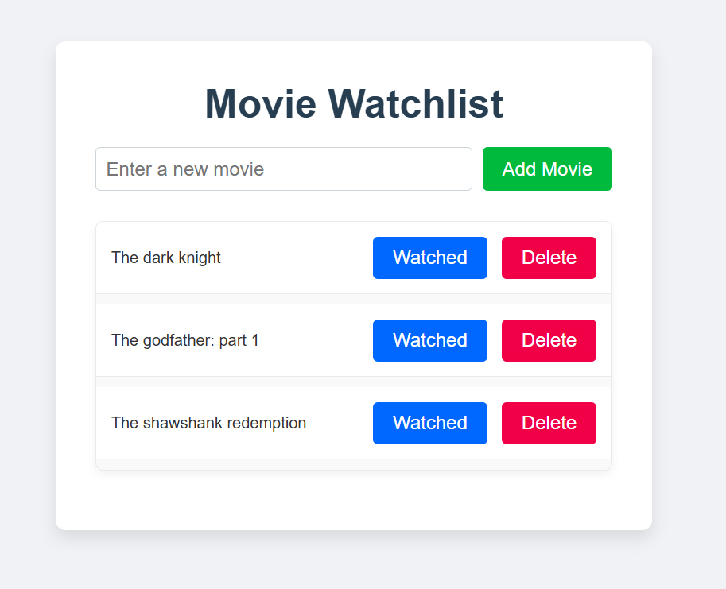

# 🎬 Movie Watchlist

## 📝 Overview
A simple PHP-based movie watchlist application where users can add, remove, and mark movies as watched.

## 📸 Screenshot

## 🚀 Features
✔️ Add movies to your watchlist  
✔️ Mark movies as watched/unwatched  
✔️ Remove movies from the list  
✔️ Simple, lightweight PHP application  
✔️ Includes a database setup file at `sql/schema.sql` for easy installation

## 📌 Usage
* Open the app in your browser.
* Add movies by entering their titles.
* Click on a movie to mark it as watched/unwatched.
* Use the delete button to remove movies.

## ❗ Known Issues
- No authentication (anyone can modify the list).
   - 🔹 This feature is planned for a future update.

